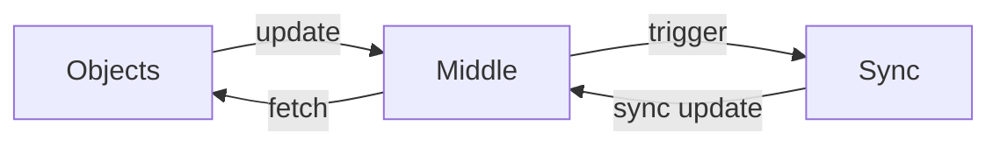

# GitSync Design Document

## Basic Ideas
- Everything is stored in git repos.
- Non-code branches contain only `.tlv` files, TLV-encoded.
- All `.tlv` file should be signed, containing a time-stamp.
  1. `git diff` can handle binary files if there is a converter which translates it into ASCII. Therefore, it does not impede readability.
  1. Every new `.tlv` file fetched from the network should be verified.
- Code branch should be protected by a meta branch, doing custodian things.
  1. One reason is that git signed commit is not easy to handle.
  1. Non-append-only branch is not easy to handle, so we can restrict security on append-only branches.
  1. Also, this keeps the history of reverting branches.
- Every non-code branches uses the same structure to store configurations.
- `admin` group has access to everything without configuration.
- In this doc, `<NAME>` means a GenericNameComponent. `[PREFIX]` means the prefix of the namespace owned by this system.
- Due to git's pack policies, git will pack up files if there are too many in a folder.
  Thus, sometimes we use the first 2 characters to group files. This is written as `<__>`.
  E.g. `refs/users/xi/xinyuma` matches with `refs/users/<__>/<uid>`.

## Project Common Refs
### Configuration `refs/meta/config`
- `project.tlv`
```text
ProjectConfig
  pid
  description
  inherit_from
  sync_interval
  ref_config*
  label*
  (other_options)

RefConfig
  ref_name
  operation_rule*
  label_rule*

LabelConfig
  name
  function
  default_value
  label_value*

OperationRule
  operation
  access
  group_gid*
  user_uid*

LabelRule
  label
  min_value
  max_value
  group_gid*

LabelValue
  number
  description
```
Access can be (ALLOW, DENY).
Function can be (MaxWithBlock, AnyWithBlock, MaxNoBlock, NoBlock)

### Local info `refs/local/*`
Not public. Only used to store local info related to a specific project.

## Users Repo `All-Users.git`
### User `refs/users/<__>/<uid>`
How users git their UID is out sourced to certificate issurance system.
`admin` user under `admin` group holds the trust anchor.
This account should be avoided in normal operations, and only `admin` group can modify it.

- `account.tlv`
```text
AccountConfig
  uid
  full_name
  email
```
- `KEY/<key-id>.cert`
A file holding an NDN certificate.
Key name should be `[PREFIX]/users/<uid>/KEY/<key-id>`
`<key-id>` should be eocnded by hex.

- `KEY/<key-id>.revoke.tlv`
Only exists when a key is revoked.
We do not assume the clock is synced, so we include current HEADs of every branch to indicate when it is revoked.
```text
Revoke
  key_id
  revoke_time
  current_head*
```

### Group `refs/groups/<__>/<gid>`
- `group.tlv`
```text
GroupConfig
  gid
  full_name
  owner
  member_uid*
```
A group has a single owner user.
This may not scale well, but let us slow start.

## Projects Catalog Repo `All-Projects.git`
### Projects catalog `refs/projects/catalog`
- `projects.tlv`
Plain text, containing a list of projects.
Everyone can create new projects, but we need a catalog to avoid conflict.
A peer can choose to track a project or not.
However, projects cannot be removed.

### Security template `refs/meta/config`
- `project.tlv`
This is used as a template for all projects.

## Code Repo `<PID>`
`<PID>` can contain a "/" inside.

### Branch catalog `refs/meta/catalog`
- `branches.tlv`
Plain text, containing a list of code branches.
Everyone can create new branches, but we need a catalog to avoid conflict.
Branches cannot be removed.
*How can we rename or remove a branch when necessary?*

- `changes.tlv`
Plain text, containing a list of Change-IDs.

### Code branch `refs/heads/<code-branch>`
Code branch.
Also, in access rules, this is used to set the direct access priviledge.
Do not sync this branch; sync `bmeta` instead.

### Code branch meta branch `refs/bmeta/<code-branch>`
- `head.tlv`
```text
HeadRef
  head
  change-id
  change-id-meta-commit
```
Contains the current HEAD of `refs/heads/<code-branch>`.
Must be signed.
As `refs/bmeta/<code-branch>` itself has commit history, there is no need to store historical HEADs.
This branch cannot be reverted / rebased.
Conflicts cannot be auto resolved; a user needs to force-push.
Last 2 components are optional and only used if there exists code review.

### Virtual branch `refs/for/<code-branch>`
Not exists physically.
Used to propose changes, and specify the priviledge for proposing changes.

### Patch-set branch `refs/changes/<__>/<Change-ID>/<PatchSet>`
Code branch. Immutable.

### Code review branch `refs/changes/<__>/<Change-ID>/meta`
- `change.tlv`
```text
ChangeMeta
  change-id
  status
  patch_set
  subject
```
Status can be (NEW, MERGED, ABANDONED).

- `<PatchSet>/votes/<reviewer-uid>.tlv`
```text
Vote
  label
  value
```

- `<PatchSet>/comments/<comment-id>.tlv`
```text
Comment
  comment_id
  filename
  line_nbr
  author
  written_on
  message
  rev_id
  unsolved
```
CommentId is some hash name.
Filename is the file commented like "README.md". "/COMMIT_MSG" means the commit message.
LineNbr is the line number (1-based) to which the comment refers, or 0 for a file comment.
rev_id is the commit of the PatchSet (SHA-1).
unsolved can be (true, false). A thread is decided by the last post.

## GitSync Namespace
- `[PREFIX]/users/<uid>`: User info for a specific user.
  - `./KEY/<key-id>`: User's certificate.
- `[PREFIX]/project/<PID>`: Used to fetch an object/ref under a specific project.
  - `./objects/<sha-1>/<seg=i>`: A (segmented) git object.
  - `./refs/<branch-name>`: Interests to learn the head of a branch.
    - `./<v=timestamp>`: Data containing the current HEAD.
  - `./sync/<params-digest>`: Sync Interest.

## Sync Protocol

### When to advertise
- The system starts.
- When the local user made some changes.
- After an auto-merge happened.
- After a time interval.

### Content of Sync Interest
- Pairs of (branch, HEAD) + changes-heads
- Branches included
  - `refs/meta/*`
  - `refs/bmeta/<code-branch>`
  - `refs/projects/catalog`
  - `refs/changes-hash`: A virtual branch, containing a hash on change-head-list.
- Branches excluded
  - `refs/local/*`: not necessary
  - `refs/heads/<code-branch>`: covered by bmeta
  - `refs/for/<code-branch>`: not necessary
  - `refs/changes/*`: too many  ???
- Change-head-list
  - Contains `refs/changes/<__>/<Change-ID>/meta` for every open change.
    Closed changes can be asked specifically.
    `refs/users/<__>/<uid>` and `refs/groups/<__>/<gid>` if it's `All-Users.git`.
  - Should be accessible under `[PREFIX]/project/<PID>/objects/<changes-hash>/<seg=i>`.

### When receiving a Sync Interest
1. Cache new commits into local storage, like `./local`.
2. Fetch objects into local branches starting with `refs/local`.
3. Security check.
4. Set into target branch.

### Structure


### On receiving updates to a branch
1. Cache the commit into some place like `./local/<branch-name>`.
  This is used to restore from interruption/crash.
1. Create the `refs/local/<branch-name>` branch.
1. Start the receiving process.

### Receiving process
1. For a commit, first check whether it's fetched. If yes, we are done.
1. Fetch all files in the tree.
  Here we do not use any compress algorithm now.
1. Then go to the parent commits and repeat.

### Check process
Check the commit from the oldest to the latest w.r.t. HEAD, set them one by one if possible.
- Immutable branch: `refs/changes/<__>/<Change-ID>/<PatchSet>` is not synced.
- Immutable files: Certificates, Revocations, Comments should not be modified.
- Append-only files: Categories should contain every existing entry.
- Consistency of ID: For every object whose first field is an ID field, the ID must be consist with the name of the file/branch.
- Files belonging to specific user: those files can only be changed by the user himself or anyone with `write`(forge) priviledge.
  - `refs/users/<__>/<uid>@*`
  - `refs/changes/<__>/<Change-ID>/meta@<PatchSet>/votes/<reviewer-uid>.tlv`
  - `refs/changes/<__>/<Change-ID>/meta@<PatchSet>/comments/<comment-id>.tlv`
    - Check the signature of new comments against the `author` field.
- Existence of ID: Every `id` field must point to an existing or a new object.
- No conflict: for all branches except `refs/heads/*`, the commit must include the current HEAD as a parent.
  There is no need to check other parents.
  For exceptions to this, refer to the automatic merge section.
- Key validation: The key should be a valid key of an user.

### Parents of a merge commit that is new to local
There is no need to check it.
- All files are contained in the merge commit. Old files, if conflict with the merge commit to move to, are not used.
- Security issue: what if A grants push access to B and then B creates this merge commit?
  - Access priviledge files are signed by the last author. If B didn't change it, it should be signed by A and works.
  - If B changed it and B had the priviledge before, then B's signature is valid.
  - If A granted the access of changing the access control file to B and B changes it, it's problematic.
    However, I don't think this is the general case.
    If the project owner wants to modify the access control rule, he should do it himself rather than outsouring.

### Priviledges
#### Operation types
- LabelRule: Granted to `refs/for/<code-branch>`.
  Affects the labels and value a user can have in
  `refs/changes/<__>/<Change-ID>/meta@<PatchSet>/votes/<reviewer-uid>.tlv`.
- Write: Written priviledge to som refs.
  Granted to `refs/config/meta` allows users to modify the config of this project.
  To `refs/changes/*` allows users to merge or abandon every change and forge every identities.
  To `refs/bmeta/<code-branch>` allows users to set the HEAD of branch arbitrarily.
  `Write` is more like Gerrit's `Owner` rather than `Push`, because it allows users to modify a physical branch.
  The owner is supposed to have priviledge `refs/*` and other reviewers/maintainers have `Push` and others.
- AddPatchSet: Granted to the ref `refs/for/<code-branch>`.
  Allow users to and add patch sets to a change.
- Push: Granted to the ref `refs/for/<code-branch>` or `refs/heads/<code-branch>`.
  To `refs/heads/<code-branch>` allows users to modify the HEAD directly.
  To `refs/for/<code-branch>` allows users to create changes.
- Abandon: Granted to `refs/for/<code-branch>`.
  Allows users to abandon or reopen a change.
- Submit: Granted to `refs/for/<code-branch>`.
  Allows users to merge or revert a change into/from the destination branch.

#### Global Operations
- CreateProject: Granted to `refs/projects/catalog`.
  Allow users to create a new project.
  Note that it is checked at the new project's `refs/meta/config@project.tlv`.
- CreateAccount: Granted to `refs/users/*`
  Allow users to create a new account.
- CreateGroup: Granted to `refs/groups/*`.
  Allow users to create a new group.

#### Automatically obtained priviledges
- `refs/projects/catalog` and `refs/meta/catalog` can be changed by anyone, as long as it is append-only.
  Push previledge is checked from the signature of the first version of `refs/changes/<__>/<Change-ID>/meta@change.tlv`.
  Similarly is CreateProject.
  This is to allow anyone create merge branches.
- `admin` group has all priviledges. This is to prevent dead project.

#### Checking order
Current system does not have Gerrit's BLOCK permission, so we only have one pass.
The rules are ordered from specific ref patterns to general patterns,
and for equally specific patterns, from originating project up to All-Projects.
For each (permission, ref-pattern, group) only a single rule ALLOW/DENY rule is picked.
If that first rule is a DENY rule,
any following ALLOW rules for the same (permission, ref-pattern, group) will be ignored,
canceling out their effect.
Denying one group does not prevent the same user accessing the file via another group.

#### Key validity
- Existing keys without revocation in current repo are considered valid.
  (In the current version let's forget about the time period because we don't have sync clock)
- A key with revocation is only valid within projects & branches written in that file,
  with commit <= the specified HEAD. (Done in next version)
- If commits in other branch is processed before the key is received, the commit should be rejected first.
  - It can be accepted in the next round of synchronization.

### Automatic merge
#### Branches and files that support auto-merge
- `refs/users/*@KEY/*`
- `refs/groups/*@group.tlv`
- `refs/projects/catalog@projects.tlv`
- `refs/meta/catalog@*.tlv`
- `refs/changes/<__>/<Change-ID>/meta@<PatchSet>/comments`

#### Commit priority
The lexigraphical order of (- time, SHA-1 hash)

#### Auto-merge processing
1. Just like *set* process, verify the commits one by one.
  Different from *set*, we don't merge them immediately after verification.
1. If finally, the remote HEAD has exactly the same file as local one, accept the one with higher priority.
  This is useful when there are multiple nodes do the same merge.
1. If the remote HEAD has the higher priority than local one,
  create a new HEAD, containing the remote HEAD and local HEAD.
1. Otherwise, readvertise the local HEAD.

### Response to sync Interest
- If remote HEAD is accepted, I don't know whether we need to respond or not...
- If the final result is different from the remote HEAD, advertise the result.
- However, if we advertised too many times in a short period, stop.

## Git Remote Helper
I realized this is not limited to NDN protocol.

## GitSync CLI
TBD

## Git Diff Textconv
Convert between TLV and JSON. (+ calculate hash name?)

## Plugins
Left for future work.
